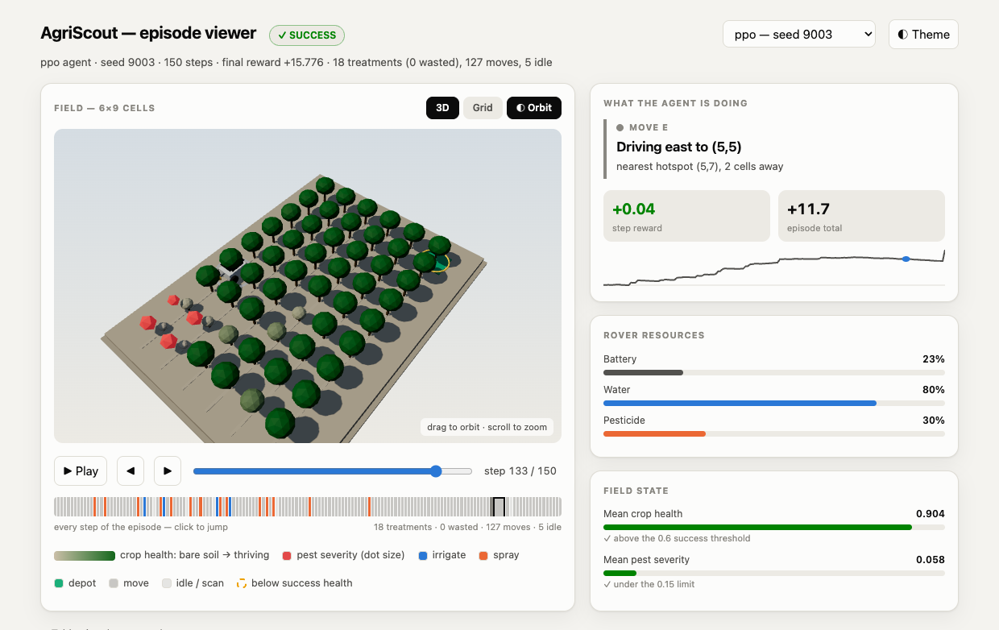
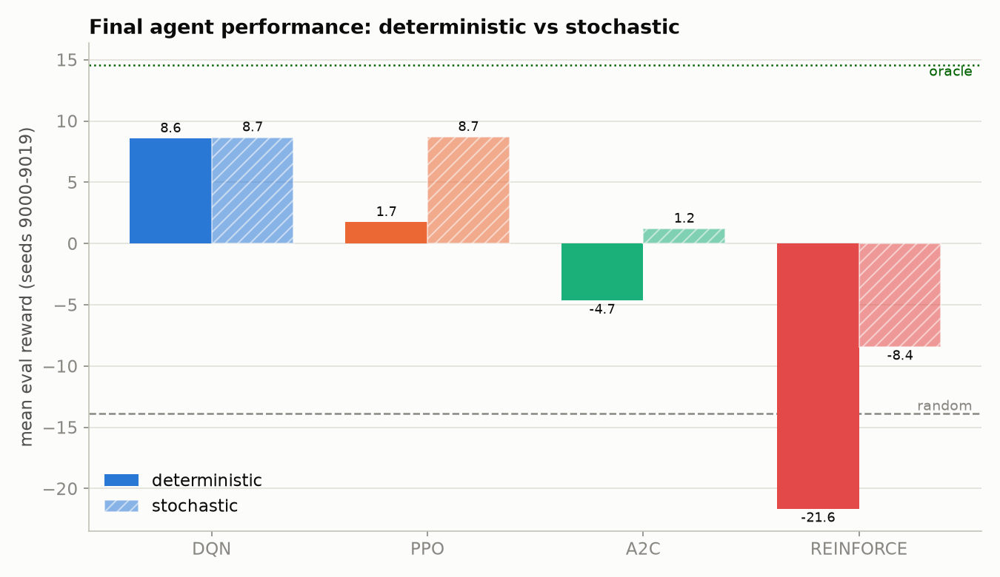
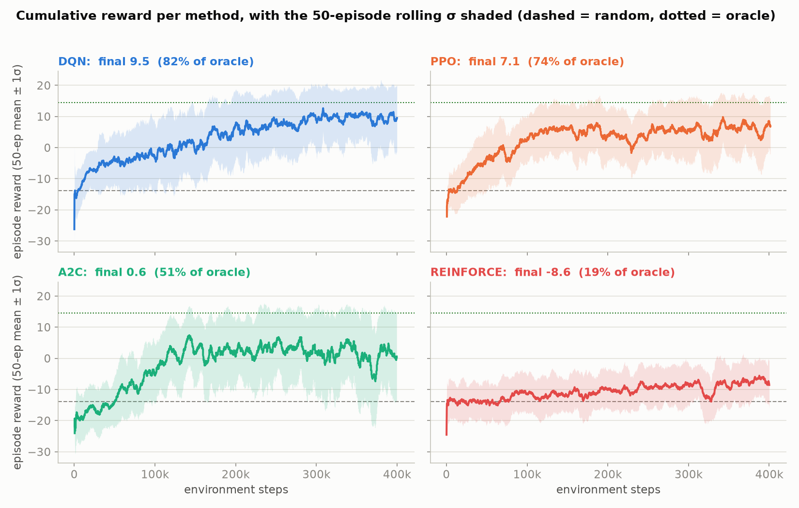

# AgriScout: reinforcement learning for autonomous crop scouting

A custom Gymnasium environment in which a rover drives a field of crop cells,
irrigating stressed plants and spraying pest hotspots while managing battery, water
and pesticide. I tune, train and compare four algorithms (**DQN, PPO, A2C and a
from-scratch REINFORCE**) under an identical environment-step budget.

📄 **[REPORT.md](REPORT.md)** is the full write-up, covering environment design, tuning analysis
per algorithm, the value-based vs policy-gradient comparison, generalization, and
limitations.



*My episode viewer, showing the trained PPO agent mid-episode. The 3D field is on the
left, where taller and greener crops are healthier, red markers are pest hotspots, and the
rover carries a locator ring. The panel on the right says what the agent is doing and
why at that exact step, and the strip under the field is every action of the episode
colour-coded by type. This run finished at +15.78 with 18 treatments and none wasted.*

---

## Quickstart

```bash
uv sync

uv run python main.py --mode evaluate          # score all four agents + references
uv run python main.py --agent dqn              # watch the best agent live (PyBullet)
uv run python main.py --agent dqn --view web   # same run in the browser viewer
uv run pytest -q                               # environment + learnability gates
```

> **Two renderers, and they look different.** `--view pybullet` (the default) opens a
> live 3D window that steps in time with the terminal output, so you can watch the
> agent and read its per-step numbers together. `--view web` records the episode and
> opens my browser viewer instead, which is the better-looking one (real lighting,
> shadows, treatment effects, scrubbing) but is built after the run rather than
> streamed live. The screenshot above is the browser viewer.

**The HTML episode viewer is the demo to open first.** It renders the episode in
WebGL (three.js) with a **3D** and a **Grid** view of the same recorded trace, and
shows *what the agent is doing and why* at every step, so it needs no narration:

```bash
uv run python scripts/record_episode.py --agent ppo --seed 9003
uv run python scripts/record_episode.py --agent oracle --seed 9003
uv run python scripts/make_demo_html.py --traces "logs/traces/demo_*_seed9003.json"
open assets/demo/index.html
```

Drag to orbit, scroll to zoom, space to play, arrow keys to step. Crop height and
colour track health, pest severity grows as red markers, and the rover's beacon and a
ground ring fire in the treatment's colour at the treated cell, so a treatment is
visible as an event, in place, without reading anything.

### Serving the agents as an API

The trained policies are exposed over HTTP as JSON, so a web or mobile client can
drive them with no RL dependency:

```bash
uv run uvicorn api:app --reload
open http://127.0.0.1:8000/docs        # interactive OpenAPI schema
open http://127.0.0.1:8000/            # the bundled viewer, served by the API
```

| endpoint | purpose |
|---|---|
| `POST /episode` | run a full episode, return every frame |
| `POST /session` → `/session/{id}/step` | stateful session; the agent picks each action |
| `POST /session/{id}/act` | same session, client-chosen action (manual override) |
| `GET /agents` | registry with per-agent eval metrics and hyperparameters |

---

## The environment

| | |
|---|---|
| **Observation** | `Box(0, 1, (176,))`: health grid, pest grid, irrigation timers, rover row/col, battery, water, pesticide, step fraction, plus 8 egocentric target features |
| **Action** | `Discrete(9)`: `MOVE_{N,S,E,W}`, `SCAN`, `IRRIGATE`, `SPRAY`, `RETURN_TO_DEPOT`, `WAIT` |
| **Episode** | 6 × 9 field, 150 steps |
| **Success** | mean health ≥ 0.60 **and** mean pest ≤ 0.15 at the final step |

Reward is action-attributed, so the agent is paid for health it adds and pest it
removes, minus waste penalties and a small time cost, plus **potential-based shaping**
(Ng, Harada & Russell 1999) on the success condition itself:

```
Φ(s) = 25·mean_health − 20·mean_pest + 1.0·(−distance to nearest work)
r    += Φ(s′) − Φ(s)
```

Shaping uses γ = 1.0, so the total it can pay over an episode telescopes to exactly
`Φ(s_T) − Φ(s_0)`: the agent is paid precisely for the net field improvement it
causes, and any cycle in Φ sums to exactly zero, so it cannot be farmed.

---

## Results

Reference policies on eval seeds 9000-9019: **random −13.88**, **oracle +14.55**.
`% of oracle` places each agent on that scale (0% = random, 100% = oracle) and is the
only figure comparable across reward-function versions.

| algo | det | stochastic | success | final health | held-out | **% of oracle** |
|---|---|---|---|---|---|---|
| **PPO** | 1.73 | **8.68** | 0.65 | 0.794 | 7.09 | **79.4%** |
| **DQN** | **8.57** | 8.66 | 0.65 | **0.858** | 7.10 | **79.3%** |
| **A2C** | −4.65 | 1.20 | 0.45 | 0.722 | −0.01 | **53.1%** |
| **REINFORCE** | −21.65 | −8.42 | 0.00 | 0.489 | −7.06 | **19.2%** |

PPO and DQN finish level. I treat the 0.1-point difference as a tie rather than a
ranking, because it is far inside the variation I would expect from a different seed.



*How the four algorithms finish, scored on twenty held-out seeds. I show both action
modes because they disagree sharply: the three policy-gradient methods are all much
better when their actions are sampled than when taken greedily, while DQN scores
almost the same either way. DQN learns action values, so its argmax is over calibrated
estimates and means something; a policy-gradient method optimises the sampled
distribution and its argmax is only a by-product.*



*The same four runs as separate panels, with a shaded ±1σ band. The overlaid chart
above is better for ranking them, but it hides how differently they behave while
learning. DQN and PPO climb fastest and settle by roughly 250k steps; A2C has by far
the widest band and swings hard late in training; REINFORCE is still climbing at 400k,
where the others have long since flattened.*

Three findings worth noting:

1. **The policy-gradient methods are all far better sampled than greedy.** PPO scores
   −10.6 deterministic and +5.5 stochastic on identical weights. Reporting only the
   deterministic policy would describe a policy nobody actually runs, so I carry both
   modes through tuning, finals, generalization and the report. My final DQN agent is
   the exception (8.57 vs 8.66), because it learns action *values*, so its argmax is over
   calibrated estimates and is meaningful, which is exactly what I would expect.
2. **No overfitting.** Every agent scores *higher* on the 50 never-seen held-out
   seeds than on training-distribution seeds (`gen_gap` is positive for all four).
3. **REINFORCE is far behind, and that is the expected result.** Per 150k env steps
   PPO performs ~23,000 gradient updates; vanilla Monte-Carlo REINFORCE performs
   ~500. Its curve is still climbing at 400k where the others have long plateaued.

---

## The central finding: winnable ≠ learnable

The first version of this environment **passed its scripted-oracle winnability gate
and was still impossible to learn**. Across 40 sweep
configurations and four 400k-step finals, roughly 8M environment steps, not one run
recorded a single success, and three of four algorithms finished *worse than random*.

Decomposing the oracle's return explained why:

| policy | total | dense (per-step) | terminal bonus |
|---|---|---|---|
| oracle | +17.03 | **−2.97** | +20.00 |
| random | −5.13 | **−5.13** | 0 |

The entire *learnable* gap was **2.16 reward over 150 steps, or 0.014/step**, against
per-episode noise of sigma between 2 and 5. Ninety percent of the oracle's advantage sat in one
all-or-nothing terminal bonus that no agent ever received, and therefore could never
learn from. Compounding it, the navigation shaping had been scaled against the
per-*episode* time cost rather than the per-*step* one, so approaching work scored
−0.015/step: the term penalised the behaviour it was added to encourage.

| | v0 | v1 |
|---|---|---|
| dense gap (oracle − random) | 2.16 | **23.43** |
| terminal bonus, as % of total gap | 90% | **18%** |
| net reward per step toward work | −0.015 | **+0.057** |
| best agent | 24.6% of oracle, 5% success | **79.4% of oracle, 65% success** |

**A scripted-oracle gate proves a task is winnable. It says nothing about whether the
task is learnable.** Two guards now enforce the difference:

- `tests/test_oracle.py` asserts a minimum **dense-reward gap** and that moving toward
  work is net-positive.
- `scripts/learnability_gate.py` trains a real agent briefly and requires it to beat
  random **before any sweep compute is spent**.

```bash
uv run python scripts/learnability_gate.py --all
```

---

## Repository layout

```
main.py               demo / evaluation CLI
api.py                FastAPI service exposing the agents over HTTP as JSON
environment/
  custom_env.py       canonical env import path
  agriscout_env.py    Gymnasium env, numpy + gymnasium only, never imports pybullet
  rendering.py        PyBullet 3D renderer (imported only when rendering)
  trace.py            episode → JSON recorder (headless, numpy only)
training/
  configs.py          40 sweep configurations (10 per algorithm)
  dqn_training.py     DQN entry point   (--sweep / --final / --run)
  pg_training.py      REINFORCE + PPO + A2C entry point
  sweep.py            THE shared entry point: train, evaluate, checkpoint, resume
  reinforce.py        from-scratch REINFORCE (3 baselines, batching, fitted critic)
  generalization.py   held-out vs training-distribution evaluation
  run_all.py          orchestrator: sweeps → finals → generalization → publish
scripts/
  learnability_gate.py  the gate that must pass before spending sweep compute
  record_episode.py     record an episode headlessly (any agent, incl. oracle/random)
  make_demo_html.py     trace → self-contained HTML viewer
  demo_scene.js         WebGL field scene (three.js), inlined into the viewer
  audit_results.py      verify results completeness
assets/demo/
  index.html            the generated viewer, one file, works offline
  vendor/three.min.js   three.js r160 (MIT, license alongside)
analysis.py           figures + tables
```

## Reproducing

```bash
AGRISCOUT_RESULTS=./logs uv run python -m training.run_all --phase all
AGRISCOUT_RESULTS=./logs uv run python analysis.py
```

Runs are **idempotent and resumable**: every run writes checkpoints plus a `DONE.json`
marker, so re-running skips completed work and an interrupted run resumes from its
last checkpoint. The sweep dispatcher is cost-weighted (PPO/A2C use a `SubprocVecEnv`
and count as 5; DQN/REINFORCE as 1) and respects `AGRISCOUT_WORKERS`.

The full pipeline takes roughly 30 minutes on 8 physical cores.

## Design notes

- **Training never imports pybullet.** The environment depends only on gymnasium and
  numpy; rendering and trace recording are separate modules. Training stays headless
  and Colab-safe.
- **I compute the reference baselines instead of hard-coding them.** I had
  `random = -5.13, oracle = 17.0` written in by hand, and when I changed the reward
  function those stale numbers stayed put and would have mislabelled every figure. I
  now derive them from the live environment and cache them keyed on `ENV_VERSION`, so
  changing the reward invalidates them for me automatically.
- **I vendor the 3D library rather than loading it from a CDN.** three.js r160 (MIT)
  lives in `assets/demo/vendor/` and I inline it into the generated page, so the demo
  is a single file that works offline with no network access. I chose the **UMD**
  build on purpose: ES-module builds cannot be imported from a `file://` page under
  Chrome's CORS rules, whereas the UMD build sets `window.THREE` from a plain
  `<script>`. r160 is the last release that ships one.
- **The 3D and 2D views cannot disagree.** Both read the same
  `episodes[ep].frames[idx]` out of the recorded trace; neither re-simulates
  anything.
- **I measured the colours rather than trusting my eye.** My first action palette was
  blue/orange/violet, but violet and blue are nearly indistinguishable to a protan
  viewer on a dark background, so violet became aqua. My first health ramp was
  amber→green, which is the classic red-green trap, so I replaced it with a single
  soil-to-green ramp. Health is encoded three ways at once (ramp colour, canopy size,
  and a dashed outline below the threshold), so nothing depends on hue alone.
