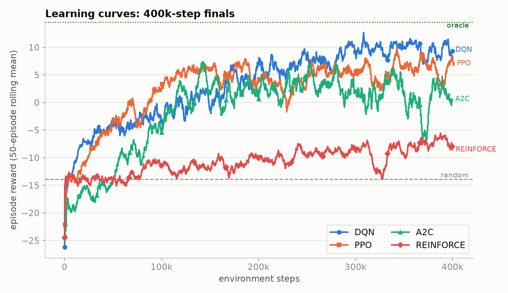
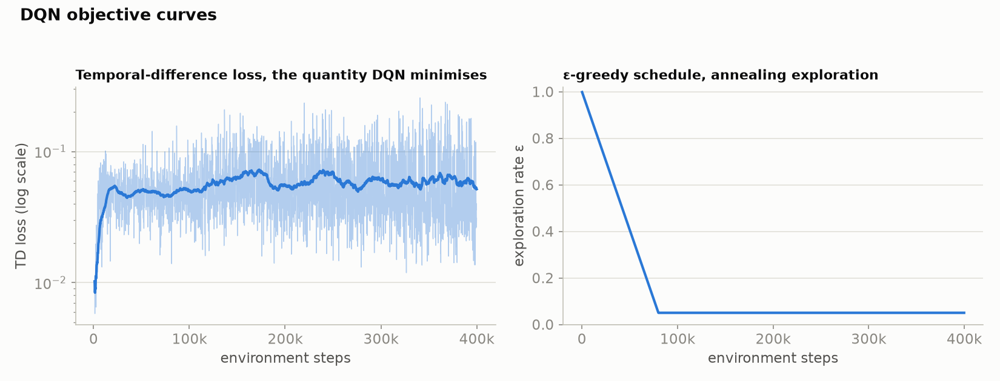
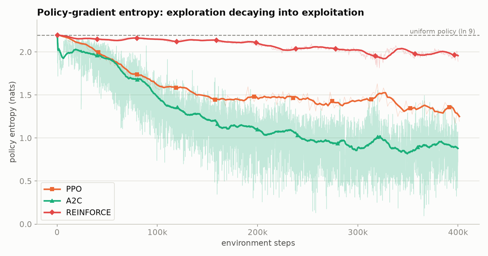
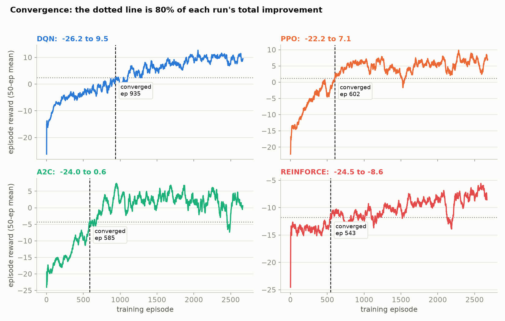
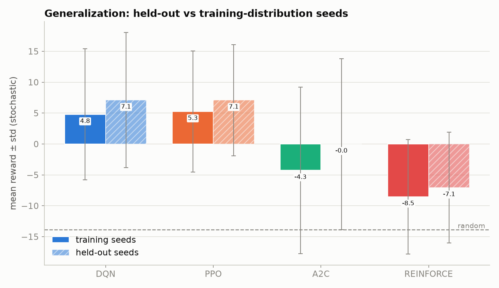

# AgriScout — comparative study of value-based and policy-gradient RL

**Task.** A rover must keep a 6×9 crop field healthy over a 150-step episode:
irrigate stressed cells, spray pest hotspots, and return to a depot to refill, while
battery, water and pesticide deplete. Four algorithms — DQN, PPO, A2C and a
from-scratch REINFORCE — are tuned and compared under an identical environment-step
budget.

**Headline result.** PPO and DQN finish in a dead heat — **79.4%** and **79.3%** of a
privileged scripted oracle's score, both at a **65% success rate** — with A2C at 53.1%
and vanilla REINFORCE at 19.2%. The single largest determinant of performance was not
the choice of algorithm or its hyperparameters; it was the **shape of the reward
function**, which in its first version made the task provably unlearnable for every
algorithm tried.

---

## 1. Environment

| | |
|---|---|
| Observation | `Box(0, 1, (176,))` — health grid, pest grid, irrigation timers, rover position, battery, water, pesticide, step fraction, + 8 egocentric target features |
| Action | `Discrete(9)` — `MOVE_{N,S,E,W}`, `SCAN`, `IRRIGATE`, `SPRAY`, `RETURN_TO_DEPOT`, `WAIT` |
| Horizon | 150 steps, 6 × 9 field |
| Success | mean health ≥ 0.60 **and** mean pest ≤ 0.15 at the final step |

Pests seed as 3–4 localized hotspots that grow and spread to neighbours with a
*saturating* probability, so an untreated infestation costs linearly rather than
exponentially. Health decays in proportion to local pest severity and recovers when
local pest is low — recovery is gated on the *cell's own* pest level, never the field
mean, so a cleaned cell always heals and collapse is never absorbing.

### Why a cell grid is the right model here, not a simplification

A cell layout can be a lazy abstraction; here it is the domain's own discretization.
Precision agriculture genuinely operates on **management zones**: multispectral drone
and satellite imagery arrives as a raster, per-cell vegetation and pest-pressure
indices are computed from it, and variable-rate applicators are driven by a raster
treatment map. The grid *is* the data structure the real problem uses, so this is a
faithful model rather than a reduced one. Concretely, the environment differs from a
grid world on every axis that matters:

| grid world | AgriScout |
|---|---|
| discrete tile types | two **continuous fields** in [0, 1] (health, pest) over 54 cells, plus per-cell irrigation timers |
| static map | **coupled stochastic dynamics** — pest growth, probabilistic 4-neighbour transmission, pest-driven health decay, recovery |
| reach a goal tile | **multi-objective control**: hold mean health ≥ 0.60 *and* mean pest ≤ 0.15 simultaneously |
| unconstrained movement | **three depleting resources** (battery, water, pesticide) with a spatially-located refill depot — a routing/logistics problem |
| deterministic | fresh layout, hotspot count and hotspot placement **every episode**; stochastic spread thereafter |

The pest process is a probabilistic cellular model with saturating transmission —
structurally an agent-based epidemiological simulation, not a maze. The state space is
continuous and effectively unbounded (a 176-dimensional real vector), not enumerable.

**The task is not solvable by trivial behaviour**, and I measured that rather than
assuming it: a uniform-random policy scores 0% success,
and so does a do-nothing (`WAIT`) policy — it is *worse* than random (−21.5 vs −13.9),
because pests left alone overrun the field. Success requires coordinated multi-step
planning: reach hotspots before they spread, treat them, irrigate the worst cells, and
return to the depot before the tanks run dry.

**Edge cases are first-class, not undefined.** Every action is legal in every state,
and each degenerate use has an explicit, penalised outcome rather than a silent no-op:
spraying an already-clean cell, irrigating an already-healthy cell, acting with an
empty tank, driving into a boundary, and calling for the depot while away from it. The
demo surfaces these as "wasted" steps, which is how the random policy is visibly
distinguished from a trained one (42 wasted actions vs PPO's 0 on the same seed).

**Production path.** The observation is exactly what a drone imagery pipeline already
produces (per-cell health and pest indices + machine telemetry), and the output is a
treatment decision per cell. §8 demonstrates the serving half of that pipeline: the
trained policies run behind a JSON HTTP API that a farm-management frontend consumes
with no RL dependency.

### Reward

Reward is **action-attributed**: the agent is paid for health it adds and pest it
removes, minus waste penalties (clean-spray, overwater, empty-tank, wall-bump) and a
small time cost. Natural pest growth and passive decay change the world but never the
reward, so per-step return is not polluted by dynamics the agent cannot control.

On top of that sits **potential-based shaping** (Ng, Harada & Russell, 1999):

```
Φ(s) = 25·mean_health − 20·mean_pest + 1.0·(−distance to nearest work)
r   += Φ(s′) − Φ(s)
```

Shaping uses γ = 1.0, so the total it can pay over an episode telescopes to exactly
`Φ(s_T) − Φ(s_0)`. Two consequences matter: the agent is paid precisely for the *net*
field improvement it causes, and any cycle in Φ sums to exactly zero, so the term
cannot be farmed. Coefficients were set from measured trajectory spread, not intuition
— oracle and random policies differ by +0.487 mean health and −0.570 mean pest.

---

## 2. Method

- **Budget in environment steps**, so algorithms with different update mechanics are
  compared fairly: 100k per sweep configuration (250k for REINFORCE, justified in §5),
  400k for every final.
- **Two-stage protocol.** 40 sweep configurations (10 per algorithm) rank
  hyperparameters within an algorithm; the best configuration per algorithm is then
  retrained from scratch at 400k steps for the cross-algorithm comparison.
- **Three disjoint seed sets.** Tuning and finals are scored on seeds 9000–9019;
  generalization additionally uses 10000–10049, which are touched at no point during
  training or model selection.
- **Two reference policies** bound the scale: a uniform-random policy (**−13.88**) and
  a privileged scripted oracle (**+14.55**). Results are reported as *% of oracle*,
  which is the only figure comparable across reward-function versions.
- **Both action-selection modes** (greedy argmax and sampled) are measured at every
  stage — §6 explains why this turned out to be essential rather than cosmetic.

---

## 3. The central finding: winnable ≠ learnable

My first reward function passed a scripted-oracle winnability gate — the oracle scored +17.03 with a 100% success rate — and was
nevertheless impossible to learn. Across 40 configurations and four 400k finals, about
**8M environment steps, not one run recorded a single success**, and three of four
algorithms finished *worse than random*.

Decomposing the oracle's return into its dense (per-step) and terminal parts showed
why:

| policy | total | dense | terminal bonus |
|---|---|---|---|
| oracle | +17.03 | **−2.97** | +20.00 |
| random | −5.13 | **−5.13** | 0 |

The entire *learnable* gap between optimal and random behaviour was **2.16 reward over
150 steps — 0.014 per step** — against per-episode noise of σ ≈ 2–5. Signal-to-noise
below 1. Ninety percent of the oracle's advantage sat in a single all-or-nothing
terminal bonus, gated on two simultaneous thresholds, that no agent ever once received
and therefore could never learn from.

A second defect compounded it: the navigation shaping had been scaled against the
per-*episode* time cost instead of the per-*step* one, so moving one step toward work
scored **−0.015**. The term penalised precisely the behaviour it was added to
encourage.

| | v0 | v1 |
|---|---|---|
| dense gap (oracle − random) | 2.16 | **23.43** |
| terminal bonus as % of total gap | 90% | **18%** |
| net reward per step toward work | −0.015 | **+0.057** |
| best agent | 24.6% of oracle, 5% success | **79.4% of oracle, 65% success** |

**A scripted-oracle gate proves a task is *winnable*. It says nothing about whether it
is *learnable*.** Those are different properties, and only the second predicts whether
training will work. Two guards now enforce the distinction: `tests/test_oracle.py`
asserts a minimum dense-reward gap and that approaching work is net-positive, and
`scripts/learnability_gate.py` trains a real agent briefly and requires it to beat
random *before any sweep compute is spent*.

### A second representational fix

With the reward corrected, PPO began learning but stalled, oscillating between
`MOVE_E` (0.22) and `MOVE_W` (0.26) — driving back and forth without progress. The
cause was representational: the grid is flattened into the observation vector, so an
MLP policy had to internally learn an argmax over 54 cells *and* a Manhattan distance
purely from unstructured floats, before it could act on either.

Eight **egocentric target features** (relative offset to the nearest hotspot and to the
lowest-health cell, plus local health/pest) state the navigation target directly. They
are a pure function of already-observable state — the scripted oracle computes exactly
the same argmax — so this adds no privileged information; it removes a representation
burden unrelated to the control problem. PPO's improvement over random went from +4.52
to **+21.75** on the same budget.

---

## 4. Hyperparameter tuning

Full tables: `assets/tables/hparams_{dqn,ppo,a2c,reinforce}.{csv,md}`.
Sensitivity plot: `assets/figures/fig4_hparam_sensitivity.png`.

**⚠ Methodological caveat.** Each configuration uses a *different random seed*, so a
single-run difference between two configurations conflates the hyperparameter effect
with seed noise. Where a factor is claimed to matter below, the claim is supported by
aggregating over the several configurations that share that factor level, not by any
one run. Isolating hyperparameter effects properly would need multiple seeds per
configuration — see §8.

### DQN — `lr ∈ {1e-3, 5e-4, 3e-4}`, `γ ∈ {0.98, 0.99}`, `buffer_size ∈ {50k, 200k}`

**Discount factor dominates: γ = 0.98 averages −4.41 against γ = 0.99's −10.79**, and
γ = 0.98 takes all three top places. The worst runs pair γ = 0.99 with the largest
learning rate — a long effective horizon plus an aggressive step size, the classic
recipe for Q-value divergence in a bootstrapped learner.

**Replay buffer size matters, and smaller is better here: 50k averages −5.20 against
200k's −8.72**, and every one of the top two runs uses the small buffer. This is the
opposite of the usual "bigger replay is better" intuition, and the reason is the
budget: at 100k sweep steps a 200k-transition buffer never even fills, so it keeps
serving transitions collected during the early near-random phase. The small buffer
cycles roughly twice per run, keeping the sampled distribution closer to the current
policy. Replay size is not a free parameter — it interacts with the training budget.

Buffer size replaced `exploration_fraction` in the grid after an earlier sweep measured
the latter as having no effect (0.1 → −5.75 vs 0.2 → −5.61); with a densely shaped
reward, the ε schedule is not what limits this agent.

The best configuration (`dqn_04`: lr 5e-4, γ 0.98, 50k buffer) retrained at 400k steps
produced the study's strongest final agent on field health (0.858) and matched PPO on
reward.

### PPO — `lr ∈ {3e-4, 1e-3}`, `n_steps ∈ {256, 512}`, `ent_coef ∈ {0, 0.01, 0.05}`

Entropy regularisation is the clearest single factor in the whole study, and it is
non-monotonic:

| `ent_coef` | mean stochastic reward | best |
|---|---|---|
| 0.00 | 1.63 | 4.53 |
| **0.01** | **3.71** | **5.54** |
| 0.05 | 1.98 | 2.25 |

Too little entropy and the policy commits early to a mediocre routine; too much and it
never commits at all, dithering permanently. 0.01 is the balance point, and the best
overall configuration (`ppo_03`) pairs it with the longer 512-step rollout.

### A2C — `lr ∈ {7e-4, 3e-4}`, `n_steps ∈ {5, 16}`, `ent_coef ∈ {0, 0.01, 0.05}`

A2C was the least stable learner. Rollout length is the factor that separates its runs:
**`n_steps = 5` averages −8.01 against `n_steps = 16`'s −12.64**, taking four of the top
five places, with three of the four long-rollout runs in the bottom half. With no replay
buffer and a short-horizon advantage estimate, A2C depends on frequent updates. Its
learning curve (fig. 1) shows the largest late-training oscillations of any algorithm,
including a sharp collapse and recovery near 370k steps.

### REINFORCE — `lr ∈ {1e-3, 5e-4}`, `baseline ∈ {none, mean, value}`, `episodes_per_batch ∈ {2, 4}`

The baseline comparison is the cleanest result in the study, and it reproduces the
textbook variance-reduction ordering exactly:

| baseline | mean stochastic reward | best | n |
|---|---|---|---|
| `none` (raw returns) | −18.97 | −18.49 | 2 |
| `mean` (batch-mean subtracted) | −12.49 | −11.07 | 4 |
| **`value`** (learned critic) | **−9.40** | **−6.39** | 4 |

All four top runs use the learned critic; both `none` runs are last. To keep this
comparison meaningful, advantage rescaling divides by the standard deviation but
**never re-centres** — otherwise `none` and `mean` become mathematically identical and
the experiment measures nothing.

Three implementation fixes were required before REINFORCE learned at all. Updating from
a *single* episode left the policy at entropy 1.95 of a 2.20 maximum after 150k steps —
still essentially uniform. The critic, fitted jointly at the policy's learning rate,
never dropped below a loss of ~15, so `returns − V` was still effectively raw returns.
And without gradient clipping, every learning rate ≥ 3e-3 drove entropy to 0 within a
few updates and froze the policy on a single action (a measured, degenerate always-`WAIT`
run scoring −21.52). Batching, a separately-optimised critic, and gradient clipping
together took it from "no learning" to a steadily climbing curve.

---

## 5. Results

Reference policies on seeds 9000–9019: random **−13.88**, oracle **+14.55**.

| algo | det | stochastic | success | final health | held-out | gen. gap | **% of oracle** |
|---|---|---|---|---|---|---|---|
| **PPO** | 1.73 | **8.68** | 0.65 | 0.794 | 7.09 | +1.83 | **79.4%** |
| **DQN** | **8.57** | 8.66 | 0.65 | **0.858** | 7.10 | +2.32 | **79.3%** |
| **A2C** | −4.65 | 1.20 | 0.45 | 0.722 | −0.01 | +4.26 | **53.1%** |
| **REINFORCE** | −21.65 | −8.42 | 0.00 | 0.489 | −7.06 | +1.48 | **19.2%** |


*Fig 1 — 50-episode rolling mean of episode reward, all four methods overlaid, against
the random and oracle reference lines.*


*Fig 6 — the same curves per method with a ±1σ band. The overlay ranks methods; this
panel shows each one's stability, which the overlay hides. A2C's band is visibly the
widest.*

**PPO and DQN finish level (79.4% vs 79.3%); the policy-gradient family is not
uniformly better or worse than the value-based one.** The meaningful split is not value-based vs policy-gradient
but *how much a method reuses its experience*. PPO (clipped multi-epoch updates over a
rollout buffer) and DQN (a replay buffer) both extract many gradient updates per
environment step. A2C, which discards each rollout after one update, sits well behind
them, and vanilla REINFORCE — one update per batch of complete episodes — is last by a
wide margin.

That ordering shows up directly in the learning curves: DQN and PPO rise fastest and
plateau around 250k steps; A2C climbs more slowly and oscillates hard; REINFORCE is
still climbing at 400k, where the others have long since flattened.

**On REINFORCE's budget.** Per 150k environment steps, PPO performs roughly 23,000
gradient updates (256 steps × 4 envs, 10 epochs, minibatch 64); vanilla REINFORCE
performs about 500. It fails a 150k-step learnability gate and passes at 400k, which is
why its sweep budget was raised to 250k — at 100k its runs are indistinguishable noise
and ranking them would measure the seed rather than the hyperparameters. Its weakness
here is a real property of Monte-Carlo policy gradients, not a defect to be tuned away.

---

### Learning dynamics — the objective and entropy curves


*Fig 7 — DQN's temporal-difference loss (log scale) and its ε-greedy schedule.*

DQN's TD loss does **not** decrease over training — it rises from ~0.01 and settles
around 0.05–0.07. That is expected rather than alarming for a bootstrapped learner and
is worth stating explicitly, because a falling loss is the wrong thing to look for
here: the regression target `r + γ·max Q(s′)` is itself moving as the policy improves,
and as ε anneals the agent reaches richer, higher-reward states it had never visited
while exploring. Loss magnitude tracks target variance, not policy quality — reward
(fig 1) is the quantity that improves.


*Fig 8 — policy entropy for the three policy-gradient methods, against the ln 9
uniform-policy ceiling.*

Entropy is the clearest single diagnostic in the study, and it explains the final
ranking almost by itself:

| method | entropy 0 → 400k | reading |
|---|---|---|
| PPO | 2.20 → ~1.25 | steady, controlled commitment — the healthiest trace |
| A2C | 2.20 → ~0.90 | commits hardest and earliest; matches its wide reward band and late collapses |
| REINFORCE | 2.20 → ~1.96 | **barely leaves the uniform policy** |

REINFORCE ends 400k steps still at 89% of maximum entropy. It is not choosing badly so
much as *barely choosing at all* — which is exactly what ~500 gradient updates buys,
and is the direct cause of its 0% success rate. This is also why its greedy policy is
so much worse than its sampled one (§6): an argmax over a near-uniform distribution is
close to arbitrary.


*Fig 9 — convergence, defined as the first episode whose rolling mean reaches 80% of
the run's total improvement (start → final).*

Convergence episodes span 543–935, but the metric measures *when each run captured
most of its own gain*, not how much gain there was — so it must never be read alone.
REINFORCE "converges" earliest (episode 543) precisely because it has the least
improvement to capture, while DQN is latest (935) because it kept improving longest and
ends highest on field health. Read fig 9 together with the final values in the panel
titles.

## 6. Deterministic vs stochastic action selection

The three policy-gradient methods are markedly better *sampled* than *greedy*, and the
effect is large: across the PPO sweep the mean stochastic-minus-deterministic gap is
**+11.59 reward**. The best PPO configuration scores −10.63 greedy and +5.54 sampled
*on identical weights*.

**The final DQN agent is the informative exception** — 8.57 greedy vs 8.66 sampled, a
gap of 0.09. This is what the split should look like: DQN learns an action-*value*
function, so its argmax is over calibrated Q-estimates and is meaningful, whereas a
policy-gradient method optimises the sampled distribution directly and its argmax is
merely a by-product. That DQN alone is mode-insensitive is evidence the gap is a
property of the *policy parameterisation*, not a quirk of this environment.

This is not a curiosity; it changed the experiment twice.

1. **Model selection.** Ranking sweep runs on deterministic reward alone selected a
   different configuration for *all four* algorithms — in PPO's case discarding the
   eventual best run because its argmax happens to be poor. Selection now ranks on the
   better of the two modes.
2. **Reporting.** An early generalization table, scored greedily, showed PPO at −4.18 on
   held-out seeds and read as a generalization failure. Its stochastic held-out score is
   **+7.09** — *higher* than its training-distribution score.

The likely mechanism is that the field has many near-equivalent next actions (several
cells equally worth treating). A near-tie under argmax resolves to one fixed choice that
may be systematically poor, while sampling preserves the diversity the task rewards.

---

## 7. Generalization



Every agent scores **higher on the 50 never-seen held-out seeds than on
training-distribution seeds** (generalization gap positive for all four: +1.83, +2.33,
+4.26, +1.48). There is no measurable overfitting to the training seed distribution.

This is expected rather than surprising: every episode draws a fresh field layout,
hotspot count and hotspot placement, so an agent never sees the same field twice and
there is no fixed layout to memorise. The positive sign is best read as sampling noise
between two seed sets of different size (50 vs 20) rather than as genuine
better-than-training performance — the error bars in fig. 3 are wide enough to span it.

---

## 8. Deployment path — JSON API and web frontend

The trained policies are not left as `.zip` files. `api.py` (FastAPI) exposes them over
HTTP as JSON, in the two shapes a product actually needs:

| endpoint | purpose |
|---|---|
| `POST /episode` | run a whole episode, return every frame — enough for a client to replay it |
| `POST /session` → `/session/{id}/step` | stateful session; the **agent** picks each action |
| `POST /session/{id}/act` | same session, but a **client-chosen** action — lets a UI drive manually or override |
| `GET /agents` | registry with each agent's eval metrics and hyperparameters |

Every response is plain JSON — grids as nested arrays, rover pose, resource levels,
reward, and whether the success criteria are currently met — so a web or mobile client
renders it with no RL dependency at all. The bundled viewer
(`assets/demo/index.html`, three.js) is served from `/` as a worked example, and the
interactive OpenAPI schema is at `/docs`.

```bash
uv run uvicorn api:app --reload
curl -X POST localhost:8000/episode -H 'Content-Type: application/json' \
     -d '{"agent":"ppo","seed":9003,"include_grids":false}'
```

Verified: the `/episode` response for `ppo`/seed 9003 reproduces the recorded episode
exactly (+15.776 reward, success), and an invalid action is rejected with HTTP 422.

## 9. Limitations

- **One seed per configuration.** Sweep configurations vary the seed alongside the
  hyperparameters, so individual run comparisons conflate the two. The aggregate claims
  in §4 hold across several runs each, but a rigorous sensitivity analysis needs
  *n* seeds per configuration — roughly 3× the compute for the sweep stage.
- **Finals are single-run.** Each final is one 400k training run per algorithm, so the
  0.1-point gap between PPO (79.4%) and DQN (79.3%) is far inside seed variance and
  must not be read as a ranking — the honest statement is that they are level. The gap
  to A2C and REINFORCE is large enough to be safe.
- **A gap to the oracle remains.** The best agent reaches 79.4%; the oracle uses
  privileged state (exact argmax over the pest grid) and near-perfect resource
  planning. Closing the rest would likely need longer training or a spatially
  structured policy (see below).
- **REINFORCE never succeeds** (0% success rate). Its curve is still rising at 400k, so
  the honest statement is that it is under-trained at this budget, not that it cannot
  learn the task.

## 10. Future work

- **Spatial policy architecture.** The grid is flattened for an MLP; a small CNN over
  the (3, R, C) tensor would preserve adjacency and likely remove the need for the
  hand-engineered egocentric features entirely.
- **Multi-seed sweeps** to separate hyperparameter effects from seed noise (§9).
- **Drop the dead action.** `SCAN` is a no-op that costs battery and is used by the
  oracle 0% of the time; removing it shrinks the exploration space by a ninth.
- **Curriculum on hotspot count**, starting easy, to help REINFORCE reach a first
  success sooner within its very limited update budget.

---

## Appendix — reproducing

```bash
uv run pytest -q                                       # env + learnability gates
uv run python scripts/learnability_gate.py --all       # must pass before spending compute
AGRISCOUT_RESULTS=./logs uv run python -m training.run_all --phase all
AGRISCOUT_RESULTS=./logs uv run python analysis.py
```

Runs are idempotent and resumable (checkpoints + `DONE.json`); the full pipeline takes
roughly 30 minutes on 8 physical cores. The interactive episode viewer is
`assets/demo/index.html` — see `README.md`.
